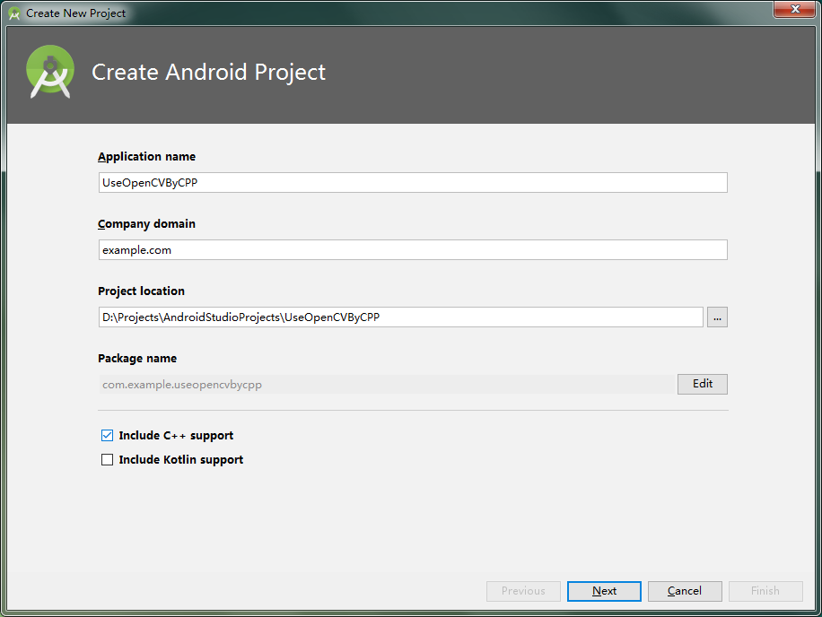
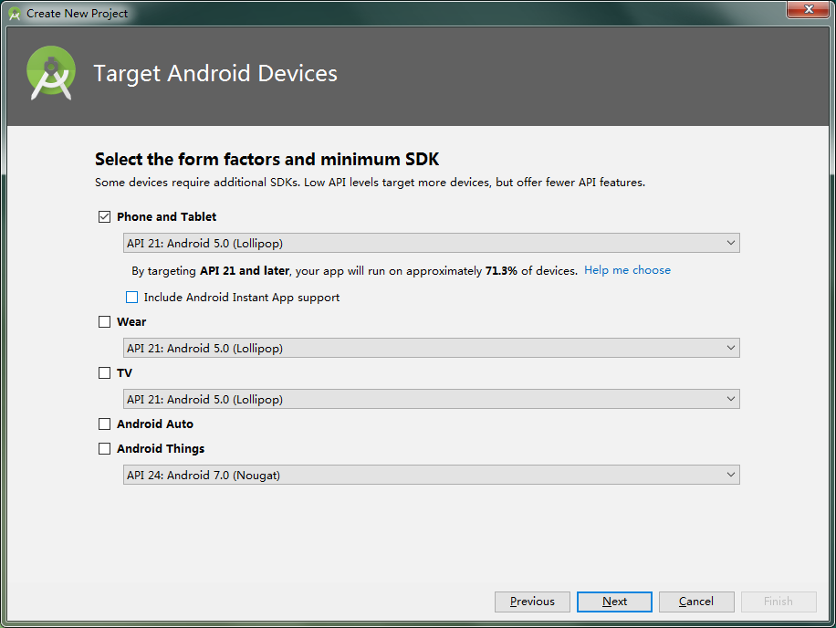
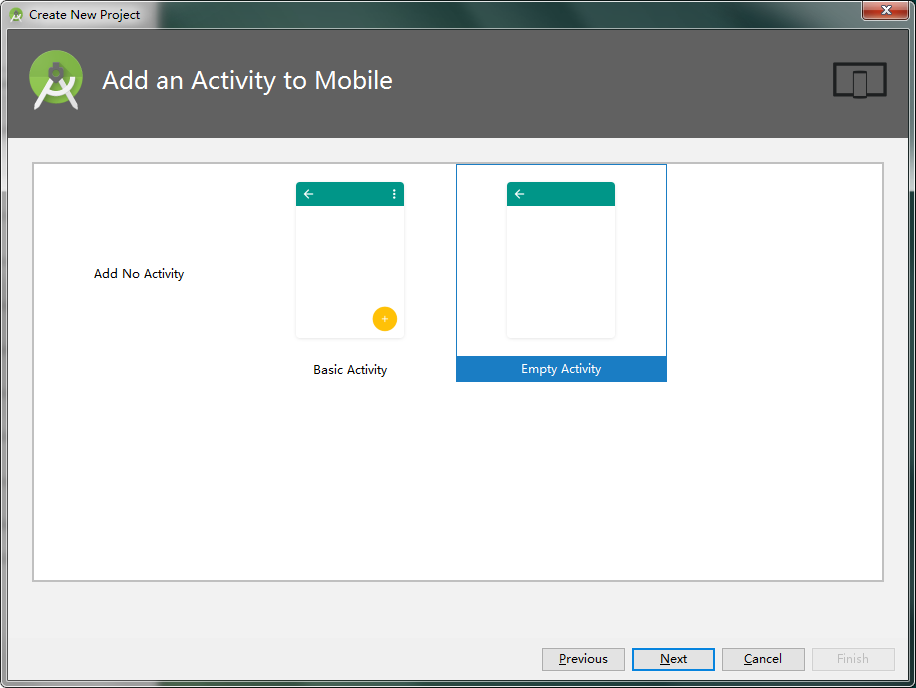
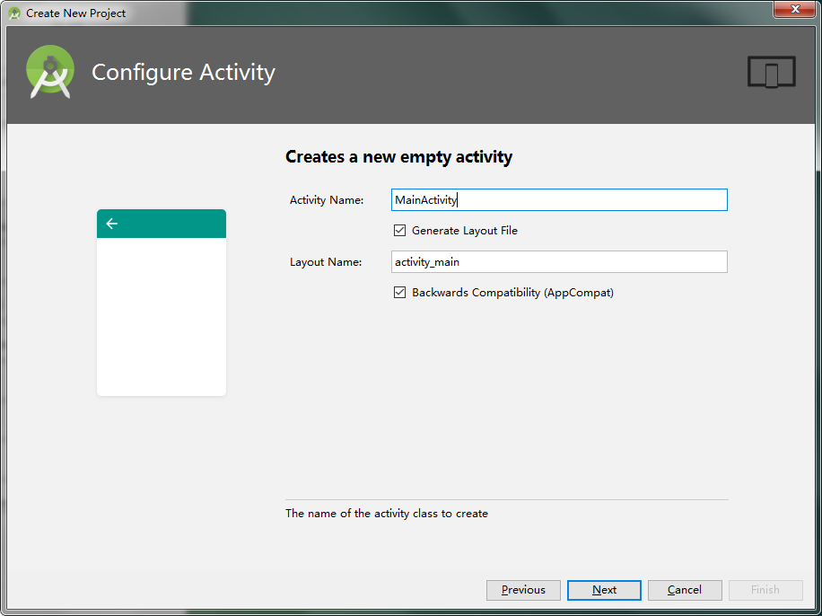
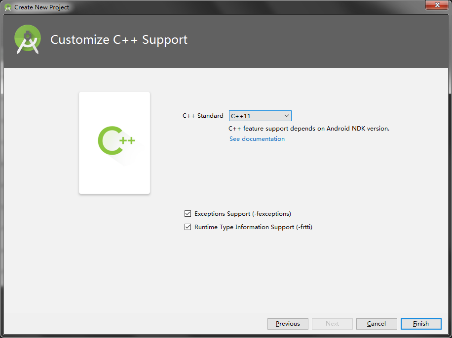
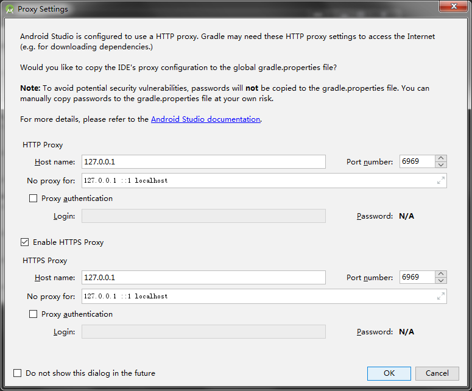
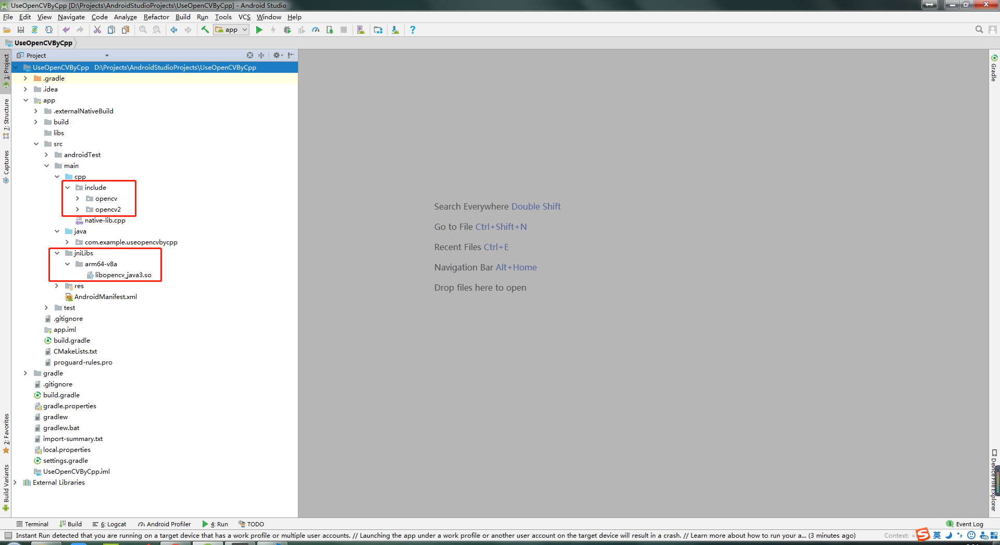
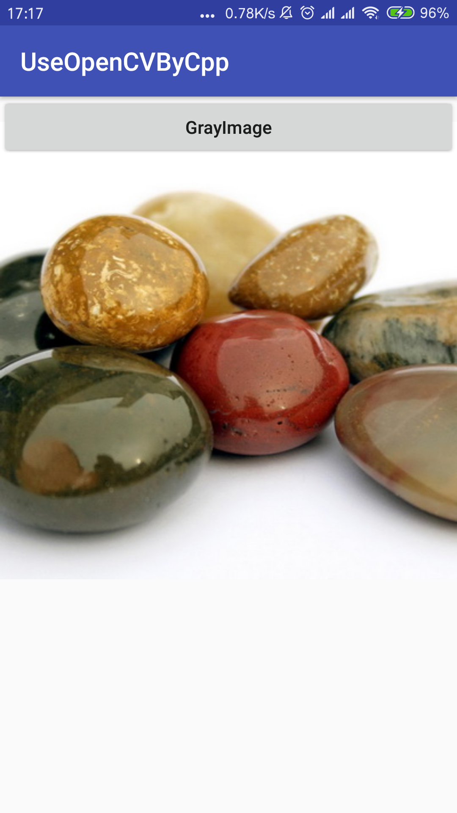
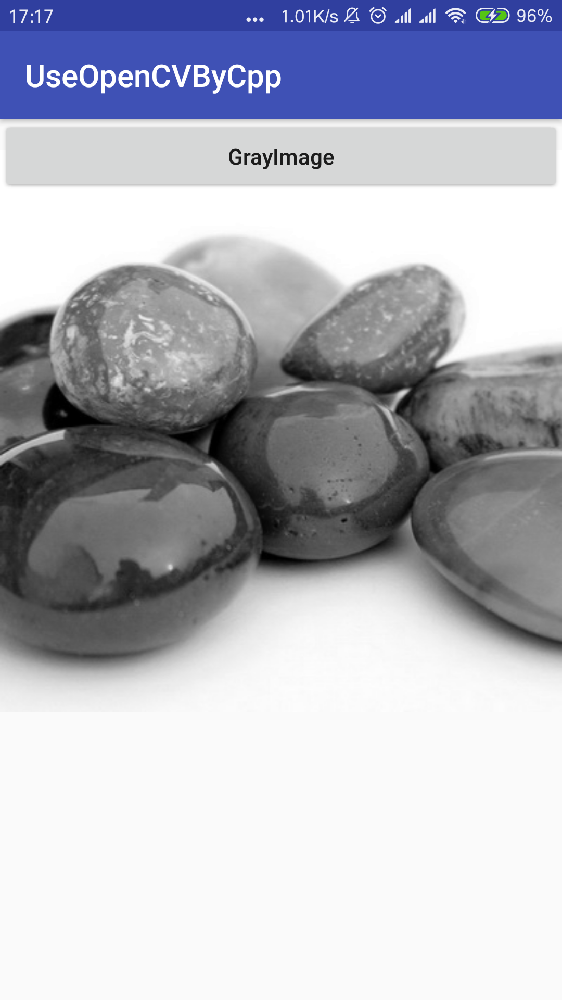

# Use OpenCV by cpp in android

This repo introduce how to use opencv cpp file in android.

## 1 Requires

- [Android Studio 3.1.3](https://developer.android.com/studio/)
- [opencv-3.4.1-android-sdk.zip](https://svwh.dl.sourceforge.net/project/opencvlibrary/opencv-android/3.4.1/opencv-3.4.1-android-sdk.zip)

## 2 Steps

### 2.1 Create UseOpenCVByCPP







> Use proxy if need.

> The proxy setting maybe different. Choose you own setting.

### 2.2 Copy OpenCV files

- `unzip opencv-3.4.1-android-sdk.zip`

- Copy `opencv-3.4.1-android-sdk\OpenCV-android-sdk\sdk\native\jni\include` folder to `UseOpenCVByCPP\app\src\main\cpp`

- Create `jniLibs` folder in `UseOpenCVByCPP\app\src\main`

- Copy subfolders in `opencv-3.4.1-android-sdk\OpenCV-android-sdk\sdk\native\libs` to `UseOpenCVByCPP\app\src\main\jniLibs`.

> Note that:  
You can only copy subfolders which you really need. In this way, we can reduce the size of released app.  
For example:  
In my case, I only need `arm64-v8a`.



### 2.3 Modify CMakeLists.txt

```cmake
# For more information about using CMake with Android Studio, read the
# documentation: https://d.android.com/studio/projects/add-native-code.html

# Sets the minimum version of CMake required to build the native library.

cmake_minimum_required(VERSION 3.4.1)

set(CMAKE_VERBOSE_MAKEFILE on)
set(ocvlibs "${CMAKE_SOURCE_DIR}/src/main/jniLibs")
include_directories(${CMAKE_SOURCE_DIR}/src/main/cpp/include)

add_library(libopencv_java3 SHARED IMPORTED )
set_target_properties(libopencv_java3 PROPERTIES
                      IMPORTED_LOCATION "${ocvlibs}/${ANDROID_ABI}/libopencv_java3.so")

# Creates and names a library, sets it as either STATIC
# or SHARED, and provides the relative paths to its source code.
# You can define multiple libraries, and CMake builds them for you.
# Gradle automatically packages shared libraries with your APK.

add_library( # Sets the name of the library.
             native-lib

             # Sets the library as a shared library.
             SHARED

             # Provides a relative path to your source file(s).
             src/main/cpp/native-lib.cpp )

# Searches for a specified prebuilt library and stores the path as a
# variable. Because CMake includes system libraries in the search path by
# default, you only need to specify the name of the public NDK library
# you want to add. CMake verifies that the library exists before
# completing its build.

find_library( # Sets the name of the path variable.
              log-lib

              # Specifies the name of the NDK library that
              # you want CMake to locate.
              log )

# Specifies libraries CMake should link to your target library. You
# can link multiple libraries, such as libraries you define in this
# build script, prebuilt third-party libraries, or system libraries.

target_link_libraries( # Specifies the target library.
                       native-lib android log libopencv_java3 # DO NOT FORGET TO CHANGE THIS LINE!!!

                       # Links the target library to the log library
                       # included in the NDK.
                       ${log-lib} )
```

## 3 Modify files

### 3.1 strings.xml

`UseOpenCVByCpp\app\src\main\res\values\strings.xml`

```xml
<resources>
    <string name="app_name">UseOpenCVByCpp</string>
    <string name="str_proc">GrayImage</string>
</resources>
```

### 3.2 activity_main.xml

`UseOpenCVByCpp\app\src\main\res\layout\activity_main.xml`

```xml
<?xml version="1.0" encoding="utf-8"?>
<android.support.constraint.ConstraintLayout xmlns:android="http://schemas.android.com/apk/res/android"
    xmlns:app="http://schemas.android.com/apk/res-auto"
    xmlns:tools="http://schemas.android.com/tools"
    android:layout_width="match_parent"
    android:layout_height="match_parent"
    tools:context=".MainActivity">

    <Button
        android:id="@+id/btn_gray_process"
        android:layout_width="fill_parent"
        android:layout_height="wrap_content"
        android:text="@string/str_proc"
        android:textAllCaps="false"/>

    <ImageView
        android:id="@+id/image_view"
        android:layout_width="wrap_content"
        android:layout_height="wrap_content"
        android:contentDescription="@string/str_proc" />

</android.support.constraint.ConstraintLayout>
```

### 3.3 Save test pic to `UseOpenCVByCpp\app\src\main\res\drawable`

`UseOpenCVByCpp\app\src\main\res\drawable`


### 3.4 Modify native-lib.cpp

`UseOpenCVByCpp\app\src\main\cpp\native-lib.cpp`

```cpp
#include <jni.h>
#include <opencv2/core/core.hpp>

using namespace std;
using namespace cv;

extern "C"
{
    JNIEXPORT jintArray JNICALL Java_com_example_useopencvbycpp_MainActivity_grayProc(JNIEnv *env, jobject instance,
                                                                                    jintArray buf, jint w, jint h) {

        jint *cbuf;
        jboolean ptfalse = false;
        cbuf = env->GetIntArrayElements(buf, &ptfalse);
        if(cbuf == NULL){
            return 0;
        }

        Mat imgData(h, w, CV_8UC4, (unsigned char*)cbuf);

        uchar* ptr = imgData.ptr(0);
        for(int i = 0; i < w*h; i ++){
            uchar grayScale = (uchar)(ptr[4*i+2]*0.299 + ptr[4*i+1]*0.587 + ptr[4*i+0]*0.114);
            ptr[4*i+1] = grayScale;
            ptr[4*i+2] = grayScale;
            ptr[4*i+0] = grayScale;
        }

        int size=w * h;
        jintArray result = env->NewIntArray(size);
        env->SetIntArrayRegion(result, 0, size, cbuf);
        env->ReleaseIntArrayElements(buf, cbuf, 0);
        return result;
    }
}
```

### 3.5 Modify MainActivity.java

`UseOpenCVByCpp\app\src\main\java\com\example\useopencvbycpp\MainActivity.java`

```java
package com.example.useopencvbycpp;

import android.graphics.Bitmap;
import android.graphics.BitmapFactory;
import android.support.v7.app.AppCompatActivity;
import android.os.Bundle;
import android.view.View;
import android.widget.Button;
import android.widget.ImageView;

public class MainActivity extends AppCompatActivity implements View.OnClickListener {

    private Button btnProc;
    private ImageView imageView;
    private Bitmap bmp;

    @Override
    public void onCreate(Bundle savedInstanceState) {
        super.onCreate(savedInstanceState);
        setContentView(R.layout.activity_main);
        btnProc = (Button) findViewById(R.id.btn_gray_process);
        imageView = (ImageView) findViewById(R.id.image_view);
        bmp = BitmapFactory.decodeResource(getResources(), R.drawable.testpic1);
        imageView.setImageBitmap(bmp);
        btnProc.setOnClickListener(this);
    }

    static {
        System.loadLibrary("native-lib");
    }

    public static native int[] grayProc(int[] pixels, int w, int h);

    @Override
    public void onClick(View v) {

        int w = bmp.getWidth();
        int h = bmp.getHeight();
        int[] pixels = new int[w*h];
        bmp.getPixels(pixels, 0, w, 0, 0, w, h);
        int[] resultInt = grayProc(pixels, w, h);
        Bitmap resultImg = Bitmap.createBitmap(w, h, Bitmap.Config.ARGB_8888);
        resultImg.setPixels(resultInt, 0, w, 0, 0, w, h);
        imageView.setImageBitmap(resultImg);
    }

    @Override
    public void onResume(){
        super.onResume();
    }
}
```

## 4 Run By Connect your Phone

### 4.1 After Start UseOpenCVByCpp app



### 4.2 After Click GrayImage Button



## 5 Reference

[opencv-ndk-dev-with-cmake-on-android-studio](http://johnhany.net/2017/07/opencv-ndk-dev-with-cmake-on-android-studio/)